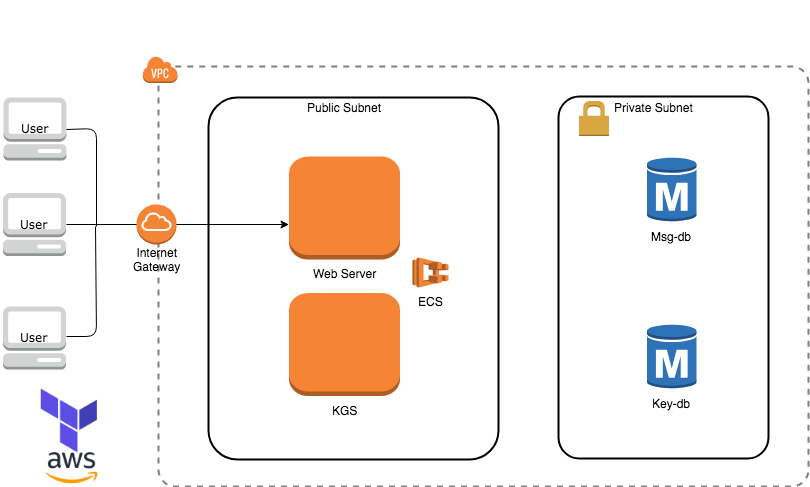

# note-whisperer
- A service for self-destructing messages 

## Purpose

    In this repo I build a service which provides self destructing messages. The user should be allowed to input text into a form. Once POSTED the system will then generate a random URL that can be used to share the note. If the random URL is viewed through GET, the URL will be "self destructed”, meaning subsequent GET to the same URL will return a 404.

## Usage

* To post a note:
> curl -d '{"message": "hello world"}' -X POST -H "Content-Type: application/json" nw-elb-primary-730274181.us-west-2.elb.amazonaws.com/post

* To read:
> curl -X GET \<url\>

## System Design (Initial Planning)

#### Capacity Estimation
* Traffic: 1 POST request per second on average; 1 GET request per second
* Bandwidth: 3 kB/s for POST messages; 3 kB/s for GET request
* Storage: ~11 MB - retention period of 1 hour


#### Application/Web Server
&nbsp;&nbsp;&nbsp;&nbsp;Based on the traffic and bandwidth estimation, a single server of the t2.micro EC2 instance type (1GiB memory) is sufficient. This qualifies for AWS Free Tier quota. If I were to design for high availability, I would also deploy a stand-by server and put both servers behind an ELB, so that a failover would have zero-downtown. However, for simplicity, I will only deploy a single web server and no ELB is associated.  

#### Key Generation Server (KGS)
&nbsp;&nbsp;&nbsp;&nbsp;This server is used for URL generation and will only run once before the service is online. The KGS will generate 5-letter URLs (~1 billion records with base64 hashing) and store them into a key database (key-db). The justification for using KGS and key-db rather than having the web server randomly generate keys on the fly is that all keys are unique, and there will not be hash collision issue to deal with.  
&nbsp;&nbsp;&nbsp;&nbsp;Because only a single web server will be alive, there will not be the concurrency issue of multiple servers trying to obtain keys, so the KGS does not need to be a long-running service. Otherwise, the KGS will be needed at all time to ensure all generated URLs are unique.  
&nbsp;&nbsp;&nbsp;&nbsp;In the case of heavy POST traffic, it would be a lot more efficient to store some available URLs in a cache. However, in the current cacpacity estimation of 1 POST request per second, caching is not necessary.  

#### Keys Database (key-db)
&nbsp;&nbsp;&nbsp;&nbsp;This database stores all possible URL keys. Each URL is 5 letters, and there are 64^5 = ~1 billion keys. This amounts to 5GB of data. Each record will also use a byte to indicate whether the key has been used or not, so in total 6GiB of storage will be used, which is under AWS Free Tier quota.  
&nbsp;&nbsp;&nbsp;&nbsp;With current traffic estimate of 1 POST request per second, there are enough unique keys for the server to run many years without replacement or needing to generate new keys. It is an overkill, but given the cheap price for storage, there is no issue regarding cost.  
&nbsp;&nbsp;&nbsp;&nbsp;If performance were a major concern for the system, I would also deploy a stand-by replica for key-db failover. But at this stage only 1 instance will be deployed.  

#### Messages Database (msg-db)
&nbsp;&nbsp;&nbsp;&nbsp;This is where all private notes will be stored. The messages will be encrypted and accessible by URL key. Each URL will be deprecated if it is accessed once or has been stale for 1 hour. Each record contains 4 bytes for URL key, 3 kB for message, 4 bytes for timestamp, and 1 byte to indicate status (viewed or not). Based on current traffic estimation, there will be 300MB of new data each day. To stay under Free Tier quota at all times, the database will need cleaning service every 30 days. However, I will not implement the cleanup service at this stage.  
&nbsp;&nbsp;&nbsp;&nbsp;For the same reason as above, only 1 instance will be deployed.  

#### Tech Stack

* NginX - HTTP server
* Flask - Application framework in Python

## Infrastructure/Networking



&nbsp;&nbsp;&nbsp;&nbsp;A few things to highlight: 
  1. The web server and KGS are orchestrated by ECS. The KGS is a task that will run once, while the web server is a long-running service. In a multi-server scenario, an ELB would be place in front of the web server to distribute traffic and allow zero-downtime. However, in current stage, a single server is sufficient, thus ELB is not needed.
  2. Both databases sit in a private subnet of my VPC for security. This blocks any access to the databases from outside the VPC. The databases will use AWS RDS for simplicity of setup. The RDS is secure, easy to administer, and Free Tier eligible, though at the cost of vendor locking.
  3. Connection between the web server and the databases will be SSL encrypted.
  
#### DevOps Tools
* Provisioning: [Terraform](https://www.terraform.io/docs/index.html)
* Configuration Management: [Docker](https://docs.docker.com/)
* Orchestration: [AWS ECS](https://docs.aws.amazon.com/ecs/index.html#lang/en_us)

&nbsp;&nbsp;&nbsp;&nbsp;I chose Docker to containerize my application because it gives me the benefit of immutable infrastructure. Once I configure my servers as microservices, I will build each container as an image and push into ECR. Then ECS can automatically orchestrate containers by pulling the images from ECR and deploying them on new servers.  
&nbsp;&nbsp;&nbsp;&nbsp;Since Docker provides my needs for configuring servers, I just need to provision the servers. This is where Terraform is a better fit than a configuration management tool. Another advantage of Terraform is its declarative style in which I only need to specify the end state of my infrastructure. This will allow me to write clean code that does not require complex logic, which is especially handy if I decide to scale up my application in the future by increasing the number of servers.  

## Testing

TBD

## Deployment
```
1. git clone https://github.com/mw123/note-whisperer.git
2. cd note-whisperer/terraform
3. terraform init
4. terraform plan -var fellow_name=<IAM keypair prefix> (e.g. If the .pem file is named "mw-IAM-keypair.pem", then fellow_name=mw)
5. terraform apply -var fellow_name=<IAM keypair prefix>
```
## Author

* **Long Yu Wang** - [mw123](https://github.com/mw123)
